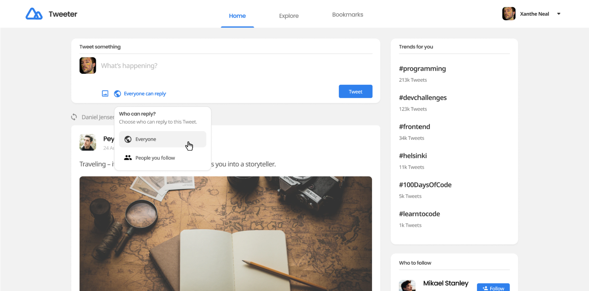

# Tweet

This is a social media.

# Overview

 

# Links

   1 - [Github](https://github.com/Tiago-Rodrigs/Social-Media-Tweeter)

   2 - [Live demo](https://social-media-twet.netlify.app/)
   
   3 - [Design](https://www.figma.com/proto/xxf4TG14lpF3vFUbBtEZUR/Tweeter?node-id=1%3A1016&scaling=scale-down-width&page-id=0%3A1)

 

# Technologies

* HTML
* CSS
* JAVASCRIPT
* REACT JS
* ROUTER
* WEBPACK
* AXIOS
* NODE JS
* SASS
* MONGODB
* FONT AWESOME
* GIT

 

# User can

* User story: I can see my profile or others' profile

* User story: When I am on a profile, I can see Tweets and Retweets. I can also filter by Tweets, Tweets and replies, Media and Likes

* User story: When I am on a profile, I can see followers and following

* User story: When I am on a profile, I can see follow or unfollow the user

* User story: I can navigate between Home, Explore and Bookmarks

* User story: I can navigate to My Profile, Group Chat (optional), Setting/Authentication App.

* User story: When I am on Home, I can post a new Tweet

* User story: When I post a new Tweet, I can choose to upload an image and set the Tweet to be public or only-follower

* User story: When I am on Home, I can see Tweets of people who I follow

* User story: I can Comment, Retweet, Like or Save a Tweet

* User story: I can Comment with image and I can like a comment

* User story: I can see the posted time of the Comments and Tweets

* User story: When I am on Home, I can see the most popular hashtags and people I should follow (it's up to you how to implement this)

* User story: When I am on Explore, I can see the Top, Latest Tweet, or Tweet with Media. I can also choose to see the most popular people

* User story: When I am on Bookmarks, I can see the Saved Tweet

* User story(optional): I can search for a group

